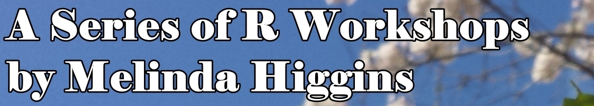

# A Series of R Workshops
#### by Melinda Higgins, Ph.D.

This "book" is the assembly of the materials compiled for the "Series of R Workshops" held Spring 2016 at Emory University - School of Nursing. These workshops were led by Melinda Higgins, Ph.D., associate research professor and senior biostatistician.

The Series for Spring 2016 is currently planned to have 4 workshops - each 2 hours long with a focus on hands-on learning using R and RStudio. These workshops will be introductory and provide the skills necessary to begin to be comfortable working with R and RStudio performing data analysis and writing research reports.

*** 

## Four R Workshops and Projected Goals

1.	[1/22/2016 "Introduction to R, RStudio and Working in the R Environment"](../workshop1/index.html)
    + Goal 1: Be able to open and work with R and RStudio on your own computer (or one you have access to) - initial familiarization with R, RStudio interface and R Environment
    + Goal 2: Initial understanding of what "packages" are, how to load them and use them
    + Goal 3: Initial understanding of where and how to get help
    
2.	[2/19/2016 "Introductory Data Management, Statistical Analyses, and Graphics with R"](../workshop2/index.html)
    + Goal 1: Further improvement of skills for working with R, the RStudio interface and configuring your R Environment
    + Goal 2: Read data into and Save data and results out of R/RStudio
    + Goal 3: Run simple statistical summaries and analyses and make simple plots

3.	[3/25/2016 "Reproducible Research with R (combining data + analysis + documentation seamlessly)](../workshop3/index.html)
    + Goal 1: Initial understanding of what Reproducible Research practices are and why they are important
    + Goal 2: Initial understanding of RMarkdown and how to use it to create HTML, PDF or Microsoft WORD formatted reports
    + Goal 3: Initial understanding of "cloud-based" repositories for interacting with and storing data, statistical results, and associated documentation.

4.	[4/22/2016 "Getting Started with Statistical Modeling with R"](../workshop4/index.html)
    + Goal 1: Initial understanding of primary data structures and objects within R
    + Goal 2: Initial understanding of running descriptive univariate and bivariate statistics
    + Goal 3: Initial understanding of simple statistical tests such as t-tests, chi-square tests and linear regression models 