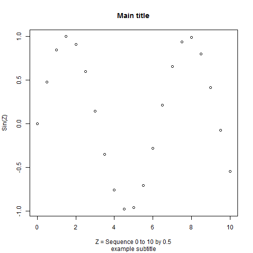
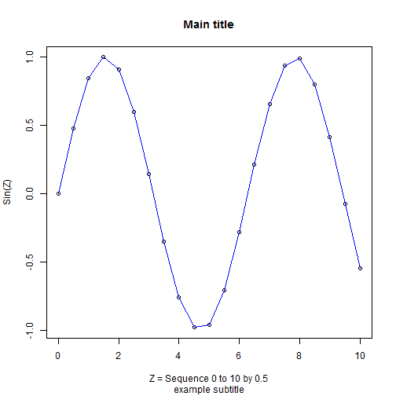

# Workshop 1 - Part 1
## Working in Basic R

--- 

For this first part, open/run the Basic R on your computer. When R opens, you will see 1 main window with 1 smaller window with a cursor `>` this is where you can type commands and get immediate feedback allowing you to work with R interactively.

## Find out which directory R thinks is your home directory

--- 

Type `getwd()` at the prompt `>` which is short for "get working directory"

C:/MyGithub/A_Series_of_R_Workshops/workshop1

Let's change this to a directory on your computer that already exists. So, go ahead and create a directory on your computer where you want to save your files and work. As an example on my computer I already created a directory for these workshops at `C:\MyR\2016_Spring_RWorkshops`. However, for this to work in R I have to flip the `\` backslashes to the `/` forward slashes. So, at the prompt to change my working directory I would type:

`setwd("C:/MyR/2016_Spring_RWorkshops")`


NOTE: On a Mac this should be `setwd("/MyR/2016_Spring_RWorkshops")`.

Next, double check to see that the working directory changed. Run `getwd()` again.

C:/MyR/2016_Spring_RWorkshops

## Let's do some math with R

--- 

Type each of the following lines at the R prompt and review the output.


```r
> 2 + 2
```

```
[1] 4
```

```r
> 3 + (4*8)
```

```
[1] 35
```

```r
> 3 + 4*8
```

```
[1] 35
```

```r
> 6 + (8**2)
```

```
[1] 70
```

```r
> 12^2
```

```
[1] 144
```

```r
> pi
```

```
[1] 3.141593
```

```r
> 4 * pi
```

```
[1] 12.56637
```

## The help system and named constants in R

--- 

As you noticed above `pi` is a named constant in R. Let's see what are the others. You can find out by using the `help()` function. Specifically, type the following:


```r
> help(Constants)
```

As you can see in the help documentation, there are 4 more named constants in R. Let's look at each one.


```r
> LETTERS
```

```
 [1] "A" "B" "C" "D" "E" "F" "G" "H" "I" "J" "K" "L" "M" "N" "O" "P" "Q"
[18] "R" "S" "T" "U" "V" "W" "X" "Y" "Z"
```

```r
> letters
```

```
 [1] "a" "b" "c" "d" "e" "f" "g" "h" "i" "j" "k" "l" "m" "n" "o" "p" "q"
[18] "r" "s" "t" "u" "v" "w" "x" "y" "z"
```

```r
> month.abb
```

```
 [1] "Jan" "Feb" "Mar" "Apr" "May" "Jun" "Jul" "Aug" "Sep" "Oct" "Nov"
[12] "Dec"
```

```r
> month.name
```

```
 [1] "January"   "February"  "March"     "April"     "May"      
 [6] "June"      "July"      "August"    "September" "October"  
[11] "November"  "December" 
```

## Let's create some data and variables with R. 

--- 

Notice that we use the `<-` assignment command. This is equivalent to using an `=` equals sign. However, the `=` sign had other functionality in R. So, to avoid confusion the assignment `<-` command is used. `x <- 5` is read as x gets 5 or rather x is assigned to 5.

You will also notice after typing each command nothing else happens - no output is shown. To see what has been assigned to each variable, you simply type the name of the variable.


```r
> x <- 3 * 5
> x
```

```
[1] 15
```

```r
> y <- 1:12
> y
```

```
 [1]  1  2  3  4  5  6  7  8  9 10 11 12
```

```r
> z <- seq(0,10,.5)
```

You notice that I didn't type `z` separately to view it. We could do that:


```r
> z
```

```
 [1]  0.0  0.5  1.0  1.5  2.0  2.5  3.0  3.5  4.0  4.5  5.0  5.5  6.0  6.5
[15]  7.0  7.5  8.0  8.5  9.0  9.5 10.0
```

or we can also use the limited tools within the Basic R interface to view the data contained in the variable `z`. Click on Edit/Data Editor, tpye in `z` to open the data editor window. This can also be opened using the `fix()` function as follows:


```r
> fix(z)
```

Alternatively you can use the `View()` function. Type both of the following - which one worked?


```r
> view(z)
```

```
Error in eval(expr, envir, enclos): could not find function "view"
```

```r
> View(z)
```

The first one typed with a lowercase v gave an error. R is CaSe sensitive!! The variables `z` and `Z` are different. This is good and bad. It is good since adding case greatly expands the range of variable names that can be used but it is bad since you have to remember exactly the way a variable was typed for it to work.

Next let's perform a transformation on z and save the results to a new variable called `sinz`.


```r
> sinz <- sin(z)
```

So, we've created about 4 variables so far. Where are they? To look at what variables and data we've created so far we have to LIST them. To do this, we use the `ls()` function in R. NOTE: Your list may look slightly different depending on your default directory and anything else you might have created along the way. You can ignore the `bib` object listed below. This is generated as part of this GITBOOK.


```r
> ls()
```

```
[1] "bib"  "sinz" "x"    "y"    "z"   
```

## Next, let's make a simple plot

--- 


```r
> plot(z,sinz)
```

 

Next redo plot with axis labels, a title and a subtitle

`plot(z,sinz,xlab='Z = Sequence 0 to 10 by 0.5',ylab='Sin(Z)',main='Main title',sub='example subtitle')`

 

The `plot()` function opens a new plot. So to overlay a line or add or modify the points in the plot there are additional functions `lines()` and `points()` that can be used to overlay and augment the exisiting plot currently displayed.

So, let's add a BLUE line to the plot overlaid on the points shown.

`lines(z,sinz,col='blue')`

 

And let's customize the points. The plotting character `pch=23` is a filled diamond. `col` defines the color and `bg` defines the filled or background color.

`points(z,sinz,pch=23,col='red',bg='black')`

 

Alternatively, we can create a script and run all of these R commands together. Here is the code all together.


```r
> plot(z, sinz,
+         xlab = 'Z = Sequence 0 to 10 by 0.5',
+         ylab = 'Sin(Z)',main='Main title',
+         sub = 'example subtitle')
> lines(z, sinz, col = 'blue')
> points(z, sinz, pch = 23, col = 'red', bg = 'black')
```

 

You can go to the File menu and click "New Script". Then cut and paste in the commands above. Then, select code, right click and "run selection or highlight code and click CTRL-R to specifically run the following code all together. Note: the spaces and line returns were added for clarity. Note: RStudio helps with good formatting practices

Once the plot is created, in the graphics Window, right click and either copy as either metafile or bitmap or Save as metafile or postscript. Metafile is the Windows Vector graphics format which is scalable and portable. The bitmap format will not scale as well. Many journals prefer postscript.

To finish Part 1 - close/exit the R program. BEFORE you close R, you can save your Workspace (xxx.RData) and save your History (xxx.Rhistory). The Workspace saves all of the variables and data you created. The History file saves every command you typed during your R session - this is similar to a SAS log file and the running SYNTAX saved to the SPSS output file and log. SPSS also has a Journal file which also saves commands you've entered during each session.

## Complete R code script from Part 1

--- 

```
# ====================================
# Workshop 1
# Part 1 - R Script
# Working in Basic R Environment
# ====================================

# Find out which directory R thinks is your home directory

getwd()

# change it to a directory on your computer
# that already exists
# The example below works on a PC
# notice that the /s are opposite from the usual
# on a PC "C:\MyR\2016_Spring_RWorkshops"
#
# I think on a Mac this would be
# setwd("/MyR/2016_Spring_RWorkshops")

setwd("C:/MyR/2016_Spring_RWorkshops")

# check to see that the working directory changed

getwd()

# ====================================
# Let's do some math with R
# ====================================

2 + 2

3 + (4*8)

3 + 4*8

6 + (8**2)

12^2

pi

4 * pi

# ====================================
# pi is a Constant built into R
# what are the others?
# ====================================

help(Constants)

LETTERS

letters

month.abb

month.name

# ====================================
# Let's create some data 
# and variables with R 
# ====================================

x <- 3 * 5

x

y <- 1:12

y

z <- seq(0,10,.5)

# click on Edit/Data Editor
# choose z
# can also invoke data editor with
# fix() function

fix(z)

# also try View function
# note that CaSe matters

view(z)
View(z)

# perform a transformation on z and save the results

sinz <- sin(z)

# let's look at the objects created so far

ls()

# make a simple plot

plot(z,sinz)

# redo plot with axis labels, a title and a subtitle

plot(z,sinz,xlab='Z = Sequence 0 to 10 by 0.5',ylab='Sin(Z)',main='Main title',sub='example subtitle')

# add a BLUE line

lines(z,sinz,col='blue')

# customize the points
# plotting character pch 23 is a filled diamond
# col defines the color
# bg defines the filled or background color

points(z,sinz,pch=23,col='red',bg='black')

# select code above, right click and "run selection"
# or highlight code and click CTRL-R
# specifically run the following code all together
# the spaces and line returns added for clarity
# Note: RStudio helps with good formatting practices

plot(z, sinz,
        xlab = 'Z = Sequence 0 to 10 by 0.5',
        ylab = 'Sin(Z)',main='Main title',
        sub = 'example subtitle')
lines(z, sinz, col = 'blue')
points(z, sinz, pch = 23, col = 'red', bg = 'black')

# In graphics Window, right click and either
# copy as either metafile or bitmap.
# or Save as metafile or postscript
# Metafile is the Windows Vector graphics format
# which is scalable and portable. The bitmap format
# will not scale as well. Many journals prefer postscript.
```


