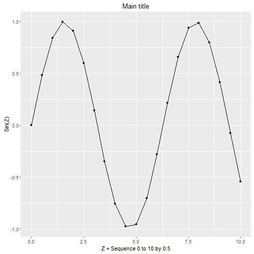

# Workshop 1 - Part 2

## Working in the RStudio 

--- 

We will go through many of the same steps we did in Part 1, but this time we will run them in RStudio so you can see how the RStudio IDE (integrated development environment) helps mangage your data, code and output much more efficiently. 

In Workshop 3 we will also explore the EXCELLENT RMarkdown functionality built into RStudio combining analysis with documentation and report writing making the entire process seamless and efficient!

While RStudio has many more windows and menus enabling point-and-click interaction with R codes and functions, it is not the typicaly GUI (graphical user interface). You cannot perform canned statistical analyses through point-and-click menus in R and RStudio. Instead you record everything - all commands - for loading, manipulating, analyzing and even reporting all of your results. This enables complete documentation of the entire process greatly improving the ability to reproduce your research!!

## Launch RStudio

--- 

Go ahead and launch RStudio and we will explore the interface.

When RStudio opens, your interface may not look the same as mine so we will systematically go through each window and explain what it does.

If you do not have a script window open, go ahead and create one. Go to "File/New File/R Script". This should open a blank window in the upper left corner of the software interface. This is basically a simple text window where we will type our R codes and then execute them rather than typing them in the "console" window (typically located in the bottom left corner).

In this window let's put in the commands we ran before in Part 1.

```
2 + 2
3 + (4*8)
3 + 4*8
6 + (8**2)
12^2
pi
4 * pi
```

You will notice that as each command above is "run" (executed) the command is echo'd in the console window at the bottom left as well as the output which is also shown in the console like we did before in the Basic R interface.

Again, what if we want to save these values? To do so we have to assign them `<-` to a variable. So, let's run through the next set of commands. As you do so, watch the upper right window for the "Global Environment".

```
x <- 3 * 5
x
y <- 1:12
y
z <- seq(0,10,.5)
sinz <- sin(z)
```
You should notice that the variables created above now show up in the top right "Global Envrionment" window. You will notice that the variable `x` shows the value of 15. However, the other variables `y`, `z`, and `sinz` all show a list of numbers. These are all vectors.

`x` is a vector of length one (1) since it has only 1 element. You can confirm this using the `length()` function. Try also running the `length()` function for each of the variables `x`, `y`, `z`, and `sinz`.


```r
> length(x)
```

```
[1] 1
```

```r
> length(y)
```

```
[1] 12
```

```r
> length(z)
```

```
[1] 21
```

```r
> length(sinz)
```

```
[1] 21
```

This is only one way to learn about the variables you created. You will also notice that in the upper right window that each vector that has more than 1 element the size of the vector is listed inside the brackets `[]`'s. Each vector is also listed as to the type of vector it is. `z` and `sinz` are "numeric" vectors whereas `y` is an "integer" vector. This can also been seen using the structure function `str()` and `class()` function. Try using these functions and compare the results exploring the structure and class of `z` and `y`.


```r
> str(y)
```

```
 int [1:12] 1 2 3 4 5 6 7 8 9 10 ...
```

```r
> class(y)
```

```
[1] "integer"
```

```r
> str(z)
```

```
 num [1:21] 0 0.5 1 1.5 2 2.5 3 3.5 4 4.5 ...
```

```r
> class(z)
```

```
[1] "numeric"
```

Another way to create vectors of data is to use the combine function `c()` which combines elements together. Try the following:


```r
> a1 <- c(1,2,3,4,10,11,12,13)
> a2 <- c('a','g','f','r','t','s')
> a3 <- c(TRUE,FALSE,TRUE,TRUE,FALSE)
> a4 <- c(1,2,'a','b',TRUE,FALSE)
> a5 <- c(1,2,3,4,TRUE,FALSE)
```

Use the `class()` function and see what type each vector is. What class type is a4? Why? What about a5?


```r
> class(a1)
```

```
[1] "numeric"
```

```r
> class(a2)
```

```
[1] "character"
```

```r
> class(a3)
```

```
[1] "logical"
```

```r
> class(a4)
```

```
[1] "character"
```

```r
> class(a5)
```

```
[1] "numeric"
```

When types are mixed, R sets them all to the type that will best encompass and retain the values. 

We will cover many more variable types in the later Workshops. However, let's look at 1 more variable type that is the mainstay of most R data handling and analyses - the **Data Frame**. One way to create a data frame is to combine vectors of the same size together. We can combine these using the `data.frame()` function. For this example we will combine the `y` vector we created with numbers 1 to 12 and combine these with the saved constant vectors of the month names (`month.name`) and month abbreviations (`month.abb`) - all 3 vectors of length 12 - although `y` is an integer vector whereas `month.name` and `month.abb` are both character vectors. **Data Frames** are designed to combine vectors of different types together as long as they are the same length.


```r
> df1 <- data.frame(y, month.name, month.abb)
```

You will notice that this new object `df1` is created and shows up in the upper right window but is now listed as "Data" instead of simply as "Values". There is also now a little blue circle with an arrow in it just to the left of object `df1`. Click this little arrow. This opens up a list of each of the variables now contained inside this data frame. You can also "View" the data in this data frame by clicking on the little table/grid icon to the right of the object listed in the top right window. This basically runs the `View(df1)` code without you having to type it. In fact, check the console window at the lower left to confirm that this is correct.

## Let's load a package with added functionality - ggplot2, aka "The Grammar of Graphics"

What are packages? R packages are how additional functionality is added to R beyond what is available in the base software system. There are 3 main ways to find packages of interest to add functionality. The biggest of the 3 is [CRAN](https://cran.r-project.org/) which is the Comprehensive R Archive Network. As of this writing there are over 7000+ packages on [CRAN](https://cran.r-project.org/web/packages/) `https://cran.r-project.org/web/packages/`. Other places to get R packages include [GitHub](https://github.com/) `https://github.com/`; [Bioconductor](https://www.bioconductor.org/) `https://www.bioconductor.org/` or simply getting the ZIP file from the creator/maintainer directly.

There are a couple of ways to install packages. Using the RStudio menus, click on "Tools/Install Packages". Usually the default Repository will be CRAN. Here you simply type in the name of the package you want "ggplot2". Alternatively, you can run the `install.packages()` function. The command to install `ggplot2` is

```
install.packages("ggplot2")
```

Once a package is installed, it is now located on your hard drive but is not yet ready to be used in R. Now you have to load the package into memory so that the functions inside that package can be used. For this you need the `library()` function. Let's load `ggplot2` and then run help on it to read more about the package.


```r
> library(ggplot2)
> help(package="ggplot2")
```

As a quick test, let's try out the `qplot()` or "quick plot" function inside the `ggplot2` package. We'll use the following code to replicate the plot we did before using the `plot()` commands in base R.

Here is the previous plot we did using the base R commands.


```r
> plot(z, sinz,
+         xlab = 'Z = Sequence 0 to 10 by 0.5',
+         ylab = 'Sin(Z)',main='Main title',
+         sub = 'example subtitle')
> lines(z, sinz, col = 'blue')
> points(z, sinz, pch = 23, col = 'red', bg = 'black')
```


Here is a similar plot using `qplot`. It will not look exactly the same. We will learn more powerful graphing functions using ggplot2 and other packages in the later workshops.


```r
> qplot(z, sinz,
+       geom = c("point", "line"),
+       xlab = 'Z = Sequence 0 to 10 by 0.5',
+       ylab = 'Sin(Z)',
+       main = 'Main title')
```



Notice the added graphics window at the lower right side of the RStudio interface. There is more functionality for viewing and exporting graphics from this window. Take a few moments and explore the "Plots" window in the lower right. Click "Zoom" to view the plot in a larger detached window. Also explore the options under the "Export" menu item within this "Plots" window.

## Complete R code script from Part 2

Note that the last command calls `sessionInfo()` which is a good practice to always do as this lists the current version of R you are running, what platform/operating system you are using as well as all packages loaded.

---

```
# ========================================
# Complete R Script for R Workshop 01
# part 2 run within RStudio
# ========================================

# ========================================
# type in math commands
# ========================================

2 + 2
3 + (4*8)
3 + 4*8
6 + (8**2)
12^2
pi
4 * pi

# ========================================
# create some objects
# ========================================
# create x which had 1 numeric value

x <- 3 * 5
x

# create y which is a numeric (integer) vector
# with 12 elements

y <- 1:12
y

# create z a numeric vector
# containing a sequence of numbers from
# 0 to 10 in units of 0.5

z <- seq(0,10,.5)

# the above code can also be done with the
# explict function arguments defined
# see the examples in help(seq)

z <- seq(from=0, to=10, by=0.5)

# create new object sinz which is a numeric
# vector now containing the sin (sine function) 
# of the z values

sinz <- sin(z)

# ========================================
# while you can see information about each of these
# objects in the Global Environment (top right)
# of the RStudio window, the function length()
# is useful for determining how many elements are
# in a given vector/data object.
# ========================================

length(x)
length(y)
length(z)
length(sinz)

# ========================================
# other functions that are helpful for finding
# out about data objects is the str() "structure"
# function and the class() function.
# ========================================

str(y)
class(y)
str(z)
class(z)

# ========================================
# so, what happens when we mix different kinds
# of data inside a vector.
# these first 3 vectors each have elements that 
# are all the same type.
# a1 is numeric
# a2 is character
# a3 is logical
# a4 is mixed numeric, character and logical
#    so R sets all to the best option
#    so a4 becomes all character type
# a5 is also mixed but only numeric and logical
#    In this case, the logical values are converted
#    to numeric and TRUE becomes 1 and FALSE becomes 0
# ========================================

a1 <- c(1,2,3,4,10,11,12,13)
a2 <- c('a','g','f','r','t','s')
a3 <- c(TRUE,FALSE,TRUE,TRUE,FALSE)
a4 <- c(1,2,'a','b',TRUE,FALSE)
a5 <- c(1,2,3,4,TRUE,FALSE)

# use the class() function to investigate these further

class(a1)
class(a2)
class(a3)
class(a4)
class(a5)

# ========================================
# so we've learned about small data objects
# but ultimately we'll be working with a 
# large dataset with numerous variables of
# different types. In R these datasets are
# called data frames. We can create one
# using the data.frame() function. Let's
# combine y which contains numbers from 1 to 12
# with the abbreviations and names of the months.
# ========================================

df1 <- data.frame(y, month.name, month.abb)

# since this is a small dataset we can
# look at in the console - just type the
# object name.

df1

# we can also View() the dataset in the viewer.
# you can also click on the little square table
# to the right of the object in the Global 
# Envionment window top right and the viewer
# will also open up.

View(df1)

# ========================================
# Installing a package
# let's try adding in some additional
# functionality into R. We'll install
# the ggplot2 package using the 
# install.packages() function and then load
# the ggplot2 package using the library()
# function.
# ========================================

install.packages("ggplot2")
library(ggplot2)
help(package="ggplot2")

# ========================================
# here are the plotting commands we used
# earlier. these are all available in the
# base R package.
# ========================================

plot(z, sinz,
     xlab = 'Z = Sequence 0 to 10 by 0.5',
     ylab = 'Sin(Z)',main='Main title',
     sub = 'example subtitle')
lines(z, sinz, col = 'blue')
points(z, sinz, pch = 23, col = 'red', bg = 'black')

# ========================================
# However, now that we've added ggplot2
# we can now use the qplot() function
# to do a "quick plot."
# ========================================

qplot(z, sinz,
      geom = c("point", "line"),
      xlab = 'Z = Sequence 0 to 10 by 0.5',
      ylab = 'Sin(Z)',
      main = 'Main title')

# ========================================
# It is a good idea when collaborating
# and sharing your code with others to take
# a snapshot of your computer system and your
# specific R environment and session settings.
# you can do this using the sessionInfo()
# function. Here is mine.
# ========================================

sessionInfo()
```

## Here is my current **SessionInfo** for Workshop 1.

--- 


```r
> sessionInfo()
```

```
R version 3.2.3 (2015-12-10)
Platform: x86_64-w64-mingw32/x64 (64-bit)
Running under: Windows >= 8 x64 (build 9200)

locale:
[1] LC_COLLATE=English_United States.1252 
[2] LC_CTYPE=English_United States.1252   
[3] LC_MONETARY=English_United States.1252
[4] LC_NUMERIC=C                          
[5] LC_TIME=English_United States.1252    

attached base packages:
[1] stats     graphics  grDevices utils     datasets  methods   base     

other attached packages:
[1] ggplot2_2.0.0       foreign_0.8-66      readxl_0.1.0       
[4] xtable_1.8-2        knitr_1.12.3        knitcitations_1.0.7
[7] Rgitbook_0.9       

loaded via a namespace (and not attached):
 [1] Rcpp_0.12.3       magrittr_1.5      munsell_0.4.2    
 [4] colorspace_1.2-6  R6_2.1.2          bibtex_0.4.0     
 [7] stringr_1.0.0     httr_1.1.0        plyr_1.8.3       
[10] tools_3.2.3       grid_3.2.3        gtable_0.1.2     
[13] digest_0.6.9      RJSONIO_1.3-0     RefManageR_0.10.5
[16] formatR_1.2.1     bitops_1.0-6      RCurl_1.95-4.7   
[19] evaluate_0.8      labeling_0.3      stringi_1.0-1    
[22] scales_0.3.0      XML_3.98-1.3      lubridate_1.5.0  
```


