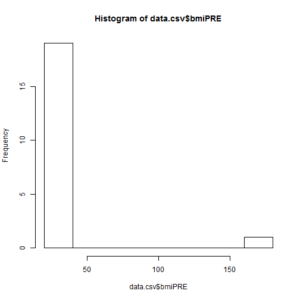
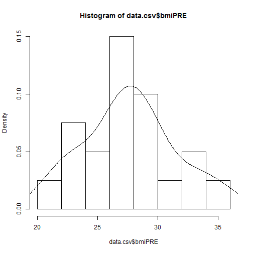
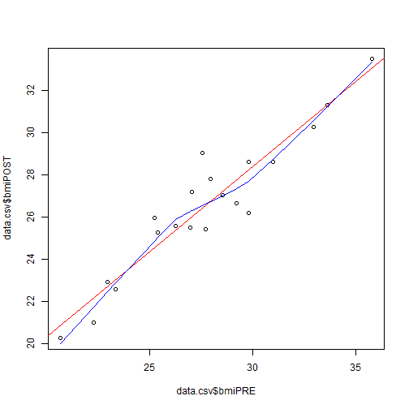

# Workshop 2 - Part 3
## Simple Stat Summaries

--- 

Now that we've read data in and exported data out of R, let's run some simple stat summaries.

## Some simple statistics


```r
> data.csv <- read.csv(file="C:/MyGithub/A_Series_of_R_Workshops/datasets/Dataset_01_comma.csv")
> summary(data.csv)
```

```
   SubjectID          Age          WeightPRE       WeightPOST   
 Min.   : 1.00   Min.   :24.00   Min.   :110.0   Min.   :108.0  
 1st Qu.: 5.75   1st Qu.:35.75   1st Qu.:166.5   1st Qu.:154.8  
 Median :10.50   Median :44.00   Median :190.0   Median :190.0  
 Mean   :10.50   Mean   :42.10   Mean   :192.9   Mean   :184.7  
 3rd Qu.:15.25   3rd Qu.:48.50   3rd Qu.:230.0   3rd Qu.:216.2  
 Max.   :20.00   Max.   :52.00   Max.   :260.0   Max.   :240.0  
                                                                
     Height           SES         GenderSTR  GenderCoded   
 Min.   :2.600   Min.   :1.00   m      :8   Min.   :1.000  
 1st Qu.:5.475   1st Qu.:2.00   f      :5   1st Qu.:1.000  
 Median :5.750   Median :2.00   F      :2   Median :1.000  
 Mean   :5.650   Mean   :1.95          :1   Mean   :1.421  
 3rd Qu.:6.125   3rd Qu.:2.00   female :1   3rd Qu.:2.000  
 Max.   :6.500   Max.   :3.00   M      :1   Max.   :2.000  
                                (Other):2   NA's   :1      
```

Let's make a histogram of the BMI's at PRE


```r
> data.csv$bmiPRE <- (data.csv$WeightPRE*703)/((data.csv$Height*12)**2)
> data.csv$bmiPOST <- (data.csv$WeightPOST*703)/((data.csv$Height*12)**2)
> hist(data.csv$bmiPRE)
```



There is a typo, so let's fix the Height typo for subject 18. It is currently entered as 2.6 and should be 5.6. After fixing it we will update the BMI calculations and then replot the histogram.

We will also overlay a density curve.


```r
> data.csv[18,"Height"] <- 5.6
> data.csv$bmiPRE <- (data.csv$WeightPRE*703)/((data.csv$Height*12)**2)
> data.csv$bmiPOST <- (data.csv$WeightPOST*703)/((data.csv$Height*12)**2)
> hist(data.csv$bmiPRE, freq=FALSE)
> lines(density(data.csv$bmiPRE))
```



Let's also make a quick scatterplot of BMI at PRE and POST and we'll overlay a linear best fit line using the `lm()` function and a non-parametric smoothed line using the `lowess()` function. We'll wrap the linear fit results with the `abline()` line function to overlay the best fit line and we'll use the `lines()` function to overlay the smoothed line.


```r
> plot(data.csv$bmiPRE, data.csv$bmiPOST, "p")
> abline(lm(data.csv$bmiPOST ~ data.csv$bmiPRE), col="red")
> lines(lowess(data.csv$bmiPRE, data.csv$bmiPOST), col="blue")
```




